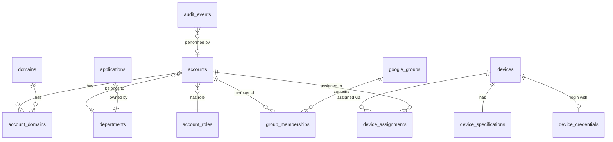

# Data Model

## Domain Map

```
                         CORE

      Company Operations, Resources & Environment


┌──────────────────────────────────────────────────┐
│                                                  │
│                    IDENTITY                      │
│                                                  │
│       Accounts • Domains • Google Groups         │
│                                                  │
└───────────────────────┬──────────────────────────┘
                        │
                        │ relationships
                        │
       ┌────────────────┼────────────────┐
       │                │                │
       ▼                ▼                ▼

   RESOURCES         SOFTWARE          ACCESS

   Laptops           Applications      Permissions
   Hardware          Licenses          Credentials
   Assets            Subscriptions     Audit

       └────────────────┼────────────────┘
                        │
                        ▼

                   AUTOMATION

                Sync • Rules • Jobs
```

---

## Entity Relationship Diagram



---

## Identity Module

### `accounts`

| Column | Type | Constraints | Description |
|--------|------|-------------|-------------|
| `id` | uuid | PK | |
| `full_name` | varchar(255) | not null | Legal full name |
| `display_name` | varchar(100) | not null | Short display name |
| `email` | varchar(255) | unique, not null | Primary email address |
| `previous_email` | varchar(255) | | Email before migration |
| `account_type` | enum | not null | `personal`, `service`, `shared` |
| `department_id` | uuid | FK → departments | |
| `account_role_id` | uuid | FK → account_roles | |
| `status` | enum | not null, default `active` | `active`, `suspended`, `archived` |
| `notes` | text | | |
| `migration_notes` | text | | Import-only historical notes |
| `created_at` | timestamptz | not null | |
| `updated_at` | timestamptz | not null | |

### `departments`

| Column | Type | Constraints | Description |
|--------|------|-------------|-------------|
| `id` | uuid | PK | |
| `name` | varchar(100) | unique, not null | Full department name |
| `code` | varchar(10) | unique, not null | Short code |
| `created_at` | timestamptz | not null | |

Seed values:

| Name | Code |
|------|------|
| Management Office | MNG |
| Operations | OPS |
| Growth | GRW |
| Experience | EXP |
| Human Resource and Development | HRD |
| Information and Technology | ITE |
| Finance and Accounting | FAC |
| General | GNR |

### `account_roles`

| Column | Type | Constraints | Description |
|--------|------|-------------|-------------|
| `id` | uuid | PK | |
| `name` | varchar(50) | unique, not null | |
| `level` | int | not null | Sort order (1 = highest) |

Seed values:

| Name | Level |
|------|-------|
| Top Management | 1 |
| Leaders | 2 |
| Non-Leaders | 3 |
| Staff | 4 |
| Commercial | 5 |

### `domains`

| Column | Type | Constraints | Description |
|--------|------|-------------|-------------|
| `id` | uuid | PK | |
| `name` | varchar(255) | unique, not null | Domain name |
| `is_primary` | boolean | not null, default false | |

Seed values:

| Name | Primary |
|------|---------|
| leadgeeksinc.com | true |
| leadgeeksinc.co | false |
| leadgeeksprospecting.com | false |

### `account_domains`

| Column | Type | Constraints | Description |
|--------|------|-------------|-------------|
| `account_id` | uuid | FK → accounts, PK | |
| `domain_id` | uuid | FK → domains, PK | |

---

## Groups Module

### `google_groups`

| Column | Type | Constraints | Description |
|--------|------|-------------|-------------|
| `id` | uuid | PK | |
| `name` | varchar(255) | not null | Display name |
| `email` | varchar(255) | unique, not null | Group email address |
| `description` | text | | |
| `member_count` | int | not null, default 0 | Cached count |
| `google_id` | varchar(255) | unique | From Google API |
| `sync_status` | enum | not null, default `pending` | `synced`, `pending`, `conflict`, `error` |
| `last_synced_at` | timestamptz | | |
| `created_at` | timestamptz | not null | |
| `updated_at` | timestamptz | not null | |

### `group_memberships`

| Column | Type | Constraints | Description |
|--------|------|-------------|-------------|
| `id` | uuid | PK | |
| `group_id` | uuid | FK → google_groups, not null | |
| `account_id` | uuid | FK → accounts, not null | |
| `role` | enum | not null, default `member` | `member`, `manager`, `owner` |
| `source` | enum | not null | `spreadsheet`, `google_sync`, `manual` |
| `added_at` | timestamptz | | |
| `created_at` | timestamptz | not null | |

Unique constraint: `(group_id, account_id)`.

---

## Assets Module

### `devices`

| Column | Type | Constraints | Description |
|--------|------|-------------|-------------|
| `id` | uuid | PK | |
| `asset_number` | varchar(50) | unique, not null | e.g. `LGI-CD-2024-042` |
| `brand` | varchar(100) | | Parsed: `LENOVO`, `MSI`, `ASUS` |
| `model` | varchar(200) | not null | Full model name |
| `computer_name` | varchar(100) | | e.g. `LeadGeeks-011` |
| `status` | enum | not null | `assigned`, `available`, `reserve`, `decommissioned` |
| `purchased_at` | date | | |
| `has_antivirus` | boolean | not null, default false | |
| `notes` | text | | |
| `created_at` | timestamptz | not null | |
| `updated_at` | timestamptz | not null | |

### `device_specifications`

| Column | Type | Constraints | Description |
|--------|------|-------------|-------------|
| `id` | uuid | PK | |
| `device_id` | uuid | FK → devices, unique, not null | 1:1 |
| `processor` | varchar(100) | | e.g. `Intel Core i5` |
| `ram` | varchar(20) | | e.g. `16 GB` |
| `storage` | varchar(50) | | e.g. `SSD 512 GB` |

### `device_assignments`

| Column | Type | Constraints | Description |
|--------|------|-------------|-------------|
| `id` | uuid | PK | |
| `device_id` | uuid | FK → devices, not null | |
| `account_id` | uuid | FK → accounts | Primary assignee |
| `custodian_id` | uuid | FK → accounts | Secondary responsible (PIC 2) |
| `assigned_at` | timestamptz | not null | |
| `returned_at` | timestamptz | | null = currently assigned |
| `notes` | text | | |
| `created_at` | timestamptz | not null | |

---

## Access Module

### `device_credentials`

| Column | Type | Constraints | Description |
|--------|------|-------------|-------------|
| `id` | uuid | PK | |
| `device_id` | uuid | FK → devices, not null | |
| `login_email` | varchar(255) | | Login account |
| `pin_hash` | varchar(255) | | **Encrypted.** Never plain text. |
| `pin_last_rotated_at` | timestamptz | | |
| `notes` | text | | |
| `created_at` | timestamptz | not null | |
| `updated_at` | timestamptz | not null | |

See [ADR-004](docs/adr/ADR-004-secrets-management.md) for secret handling requirements.

---

## Software Module

### `applications`

| Column | Type | Constraints | Description |
|--------|------|-------------|-------------|
| `id` | uuid | PK | |
| `name` | varchar(255) | unique, not null | Application name |
| `description` | text | | |
| `department_id` | uuid | FK → departments | Owning department |
| `category` | enum | | `productivity`, `security`, `development`, `communication`, `design`, `marketing`, `finance`, `operations`, `other` |
| `subscription_type` | enum | | `free`, `paid`, `freemium` |
| `status` | enum | not null, default `active` | `active`, `deprecated`, `evaluating` |
| `website_url` | varchar(500) | | |
| `created_at` | timestamptz | not null | |
| `updated_at` | timestamptz | not null | |

---

## Audit Module

### `audit_events`

| Column | Type | Constraints | Description |
|--------|------|-------------|-------------|
| `id` | uuid | PK | |
| `actor_id` | uuid | FK → accounts | Who performed the action |
| `action` | varchar(100) | not null | e.g. `account.create`, `credential.reveal` |
| `entity_type` | varchar(100) | not null | e.g. `account`, `device`, `group` |
| `entity_id` | uuid | | Target entity |
| `metadata` | jsonb | | Additional context |
| `ip_address` | inet | | |
| `created_at` | timestamptz | not null | Immutable |

---

## Summary

| Module | Tables | Records (from spreadsheets) |
|--------|--------|----------------------------|
| Identity | accounts, departments, account_roles, domains, account_domains | 42 accounts, 8 depts, 5 roles, 3 domains |
| Groups | google_groups, group_memberships | 15 groups, ~168 memberships |
| Assets | devices, device_specifications, device_assignments | 31 devices |
| Access | device_credentials | 31 credentials |
| Software | applications | 125 applications |
| Audit | audit_events | — |
| **Total** | **12 tables** | **~420 records** |
